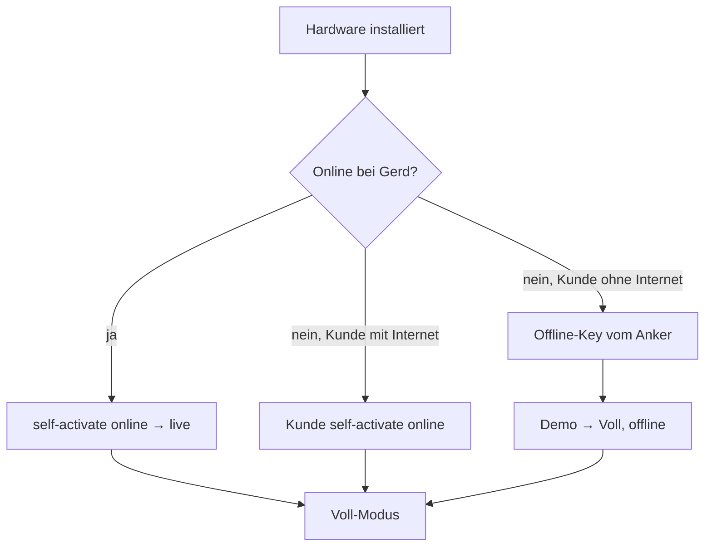
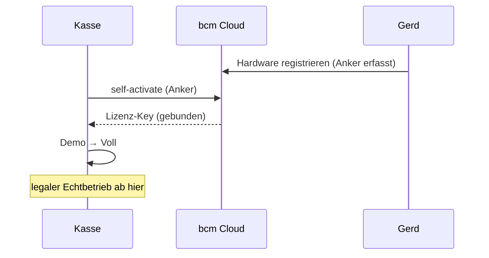
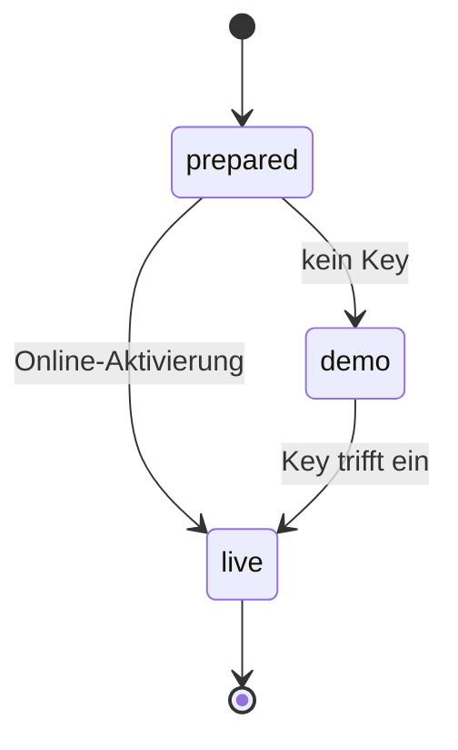

# Mermaid-Render-Test

Zweck dieser Datei: prüfen, ob ein Viewer (a) Mermaid **überhaupt** rendert,
(b) jedes Diagramm **an seiner Stelle** im Text zeigt statt alle oben zu stapeln,
und (c) die **Reihenfolge** mehrerer Diagramme hält.

**So liest du das Ergebnis:** Unten stehen drei Diagramme, eingebettet zwischen
Prosa-Abschnitten 1, 2 und 3. Korrekt ist, wenn Diagramm 1 unter Abschnitt 1
steht, Diagramm 2 unter Abschnitt 2, Diagramm 3 unter Abschnitt 3. Stehen alle
drei oben am Anfang (egal in welcher Reihenfolge), hat der Renderer das
Hoisting-Problem — genau der Ferrite-Fehler.

---

## 1. Flowchart — Aktivierungs-Pfade

Der häufigste Diagramm-Typ in Briefings. Dieser Block muss **direkt hier**
erscheinen, nicht am Seitenanfang.

Text **nach** dem ersten Diagramm. Wenn dieser Absatz unter dem Flowchart steht
und nicht über ihn rutscht, ist die Inline-Positionierung sauber.

---

## 2. Sequenzdiagramm — Online-Aktivierung

Zweiter Typ, an zweiter Position. Muss zwischen Abschnitt 2 und Abschnitt 3
landen.

Text **nach** dem zweiten Diagramm.

---

## 3. Zustandsdiagramm — Kassen-Lebenszyklus

Dritter Typ, an letzter Position. Test, ob auch `stateDiagram-v2` (neuere
Mermaid-Syntax) rendert — daran scheitern alte Engines wie Markers Mermaid 7.

Text **nach** dem dritten Diagramm.

---

## Abnahme

- [ ] Alle drei Diagramme werden als Grafik gerendert (kein roher Code).
- [ ] Diagramm 1/2/3 stehen jeweils unter Abschnitt 1/2/3, nicht oben gestapelt.
- [ ] `stateDiagram-v2` rendert (nicht nur die zwei einfacheren Typen).
- [ ] Offline geprüft (kein Netz) — falls der Viewer Mermaid per CDN nachlädt,
      bleibt hier alles roh.
